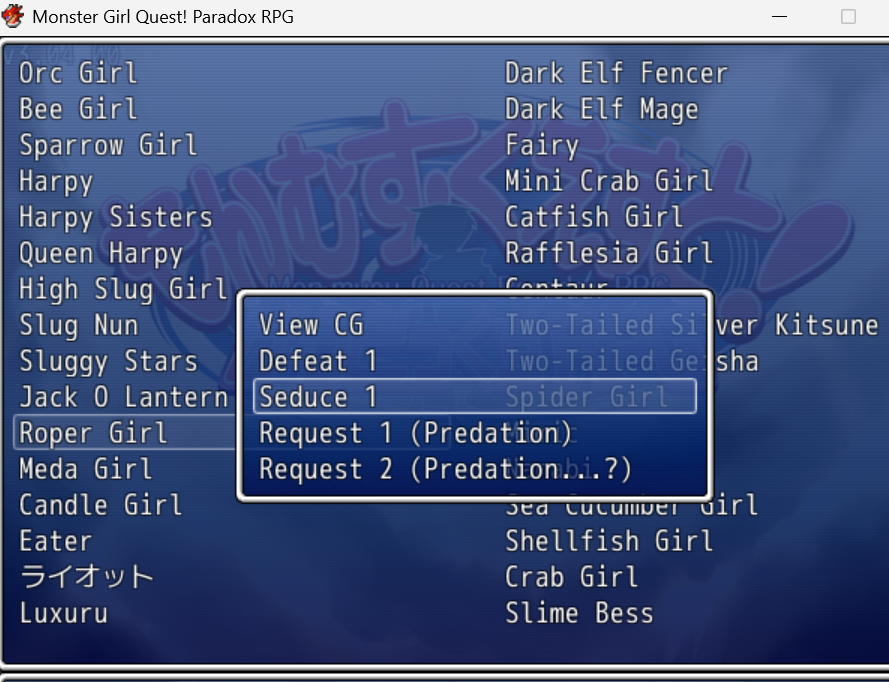

# MGQParadoxUtilities
 Utilities for the Monster Girl Quest Paradox Japanese RPG game.

## What this tool does
In the game, once you encounter a monster, you can access some of their scenes through the main menu libary menu. Each monster has a temptation they can offer during battle to allow the player to basically forfiet in exchange for a unique temptation scene that transitions to the standard defeat scene. Unfortunately this tempation scene is not available in the main menu scene library like the defeat scenes are, and these tempation scenes often have unqiue content not available anywhere else. 
This tool resolve this by adding each monster's tempation scene to the scene library.

## How it does it
All of these tempt scenes are stored in the CommonEvent2XXX.txt files (and all the defeat files are in the CommonEvent3XXX.txt for reference). Unfortunately it's not as simple as just adding entries to the gallery for all of these existing CommonEvent2XXX.txt temptation files. For one a lot of these scenes don't feature a picture of the monster girl, also I had trouble getting the hp drain to work right, so the solution I came up with was to copy the CommonEvent2XXX.txt files to CommonEvent9XXX.txt files and then reformat them to add character pictures, remove the whole hp point draining thing, and remove the struggle options unless they were pointless. Effectively the new scenes railroads the player to the end of the scene. Then these new scenes are added right below the corresponding defeat scene in the scene gallery.

# Building
This project was originally developed with a community version of visual studio, but can be built with free tools as well.
1. You will need the [].NET 9 SDK](https://dotnet.microsoft.com/en-us/download/dotnet/9.0)
2. You with the .net SDK installed you can use the [dotnet build](https://learn.microsoft.com/en-us/dotnet/core/tools/dotnet-build) command.
   such as: "dotnet build MGQParadoxUtilities.csproj"
3. That will create the console app file (amoung others) "\MGQParadoxUtilities\bin\Debug\net9.0\MGQParadoxUtilities.exe"

# Running utility to add combat tempt scenes to the H-scene gallery
## Prerequisites:
1. This utility assumes you already have a legitimate version of the Monster Girl Quest Paradox japanese RPG game. If not, try visiting the [Monmusu Quest! discord](https://discord.gg/bUjWbgEN) for more details.
2. It also assumes you have already gone through the steps of translating the game to english using the VXAceTranslator One Click Patcher process described on the [Arzor-X Blog](https://arzorx.wordpress.com/)
3. You should be comforatble running the 'Start Patcher.bat' script to patch your game regularly when new translation files are available.

## Running the tool:
1. Backup everything. This tool will largely just be adding a ton of new CommonEvent9XXX.txt files and making modifications to the '202 - Library(H).rb' file, and the tool will first backup the '202 - Library(H).rb' file to '202 - Library(H).rb.bak' before making any changes, but regardless I'd hate to be responsible for screwing up anyone's game. At a minimum backing up the 'One-Click Patcher' directory.
2. Assuming you've already successfully patched the game already, you should have a directory structure that looks like:
   Monmusu Quest! Paradox RPG Part Three
   | -- Game.exe
   | -- ...
   | -- One-Click Patcher
        | -- Start Patcher.bat
        | -- VXAceTranslator
             | -- Translated Files
                  | -- CommonEvents
                  |    | -- CommonEvents*.txt
                  | -- Scripts
                       | -- 202 - Library(H).rb

   Run the utility passing in the paths to the CommonEvents folder and '202 - Library(H).rb' file under the Translated Files directory in 'One-Click Patcher'. For example:
   
   MGQParadoxUtilities\bin\Debug\net9.0>MGQParadoxUtilities.exe -CommonEventsDir:"C:\MGQ Paradox\Monmusu Quest! Paradox RPG Part Three\One-Click Patcher\VXAceTranslator\Translated Files\CommonEvents" -HLibraryFile:"C:\MGQ Paradox\Monmusu Quest! Paradox RPG Part Three\One-Click Patcher\VXAceTranslator\Translated Files\Scripts\202 - Library(H).rb"

3. If it finishes with "Done, time elapsed:" it means the tool was successful.
   If you see errors or exceptions, double check your file paths.

4. Now re-run the Start Patcher.bat
5. Start the game and you should see the scenes added to the scene gallery from the main menu:

# FAQs
1. Q: Why not just contribute to the translated files bitbucket repo maintained by the translation team?
   A: Paradox 3 just came out and there are a lot of untranslated files and scenes still, plus updates to existing scenes reguarly happen. Since this just produces a bunch of copies existing translated tempt scenes, it made more sense to make an automated tool for doing this rather than creating a bunch of new checked in scene files that the translation team would now need to keep in sync with the original tempt scenes.
2. Q: Do I need to re-run this tool each time I grab a new drop of the translation files?
   A: Yes.

